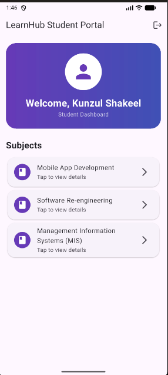
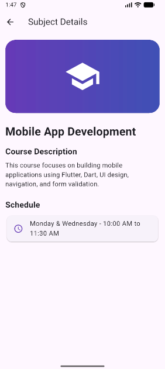

# EduNova Portal 📚

A modern multi-screen Flutter application developed for Mobile Application Development coursework.

## 👨‍🎓 Student Information

- **Name:** Kunzul Shakeel
- **Project:** EduNova Portal
- **Technology:** Flutter & Dart

---

## 🚀 Features

### 🔐 Authentication System
- User Registration
- Login Screen
- Remember Me Checkbox
- Show/Hide Password
- Form Validation
- Logout Functionality

### 📋 Registration Validation
- First Name Validation
- Last Name Validation
- Email Validation
- Password Security Rules
- Confirm Password Validation
- Gender Dropdown Selection

### 📚 Dashboard
- User Welcome Section
- Subject List
- Subject Navigation
- Dynamic Subject Cards

### 📖 Subject Detail Screen
- Subject Description
- Schedule Information
- Subject Banner UI

---

## 🧠 Subjects Included

- Mobile App Development
- Software Re-engineering
- Management Information Systems (MIS)

---

## 🛠 Technologies Used

- Flutter
- Dart
- Material Design
- Stateful Widgets
- Navigation
- Form Validation

---

## 📂 Project Structure

```text
lib
├── controllers
│   └── auth_controller.dart
├── enums
│   └── app_enums.dart          # includes CourseLoadStatus (loading/success/empty/error)
├── models
│   ├── course_model.dart       # Course model (API + local cache)
│   ├── subject_model.dart
│   └── user_model.dart
├── services
│   └── course_api_service.dart # HTTP ONLY — GET/POST/PUT/DELETE
├── local
│   └── course_local_service.dart # Hive-backed offline cache
├── repository
│   └── course_repository.dart  # Decides API vs. local cache
├── providers
│   └── course_provider.dart    # ChangeNotifier — UI state + optimistic updates
├── screens
│   ├── course_form_screen.dart # Add/Edit course form
│   ├── courses_screen.dart     # Course list + CRUD UI (Provider-driven)
│   ├── dashboard_screen.dart
│   ├── detail_screen.dart
│   ├── login_screen.dart
│   └── register_screen.dart
├── validators
│   └── app_validator.dart
└── main.dart                   # Initializes Hive before runApp
```

---

## 📱 Screenshots

### Login Screen


### Registration Screen


### Dashboard Screen


### Subject Detail Screen


### Courses (Offline-First) — Add screenshots below after running the app


> ⚠️ The Course screenshots above are placeholders. Run the app
> (`flutter run`), navigate to **Dashboard → Courses (Offline-First)**,
> capture the list, add, edit, delete-confirmation, and offline-banner
> (turn on airplane mode) screens, and save them into the `screenshot/`
> folder using the filenames above.

---

## 💡 Assignment Requirements Covered

✅ Registration Screen  
✅ Login Screen  
✅ Dashboard Screen  
✅ Detail Screen  
✅ Form Validation  
✅ Custom Validator Class  
✅ Enum Implementation  
✅ Controller Layer  
✅ Navigation & Data Passing  
✅ Multi-Screen Flutter UI  

---

## 🌐 REST API Integration (CRUD)

### API Used
**JSONPlaceholder** — a free fake REST API for testing/prototyping.
- Base URL: `https://jsonplaceholder.typicode.com`
- Resource used: `/posts` (mapped to "Course" records — `title` → course
  title, `body` → course description, `id` → course id)

### Documentation Followed
https://jsonplaceholder.typicode.com/guide

### What Was Implemented

| Operation | HTTP Method | Endpoint             | Where it's called from                     |
|-----------|-------------|-----------------------|---------------------------------------------|
| Read      | GET         | `/posts?_limit=10`    | `CourseApiService.fetchCourses()`            |
| Create    | POST        | `/posts`              | `CourseApiService.addCourse()`               |
| Update    | PUT         | `/posts/:id`          | `CourseApiService.updateCourse()`            |
| Delete    | DELETE      | `/posts/:id`          | `CourseApiService.deleteCourse()`            |

> Note: JSONPlaceholder is a mock API — it does not persist data on its
> server. POST/PUT/DELETE are real network calls with realistic responses,
> but a fresh GET still returns the original seed data. The app keeps its
> own local cache (see below) so CRUD changes remain visible across the UI
> and across app restarts, even though the "server" itself doesn't retain them.

---

## 📴 Offline Support, State Management & Repository Pattern

This section covers the second iteration of the app, built on branch:

```
feature/offline-cache-and-state-manangement
```

### Tools & Packages Used

| Concern                | Package             | Why |
|-------------------------|----------------------|-----|
| State management        | `provider` ^6.1.2    | Lightweight, idiomatic ChangeNotifier-based state management; keeps UI reactive without boilerplate. |
| Local/offline storage    | `hive` / `hive_flutter` | Fast, pure-Dart key-value store. Course data is cached as JSON so no code generation (`build_runner`) is required. |
| Connectivity detection   | `connectivity_plus` ^6.0.5 | Lets the repository decide "network or cache" up front, and lets the app auto re-sync when connectivity returns. |
| Networking (unchanged)  | `http` ^1.2.2        | Used only inside `CourseApiService`. |

### Architecture

```
UI (CoursesScreen)
   │  reads/calls
   ▼
State Management (CourseProvider — ChangeNotifier)
   │  calls
   ▼
Repository (CourseRepository)
   │            │
   ▼            ▼
API Service   Local Storage
(CourseApiService)  (CourseLocalService — Hive)
```

- **`lib/services/course_api_service.dart`** — HTTP only. Knows nothing
  about caching, offline state, or the UI. GET/POST/PUT/DELETE against
  JSONPlaceholder.
- **`lib/local/course_local_service.dart`** — Local storage only. Wraps a
  Hive box and stores/reads the last-known course list as JSON, plus a
  "last synced at" timestamp.
- **`lib/repository/course_repository.dart`** — The single source of
  truth. On `getCourses()`, it checks connectivity first:
  - **Offline** → returns cached data immediately, no network call.
  - **Online** → calls the API, caches the fresh result, returns it.
  - **Online but the request fails anyway** (timeout/server error) →
    falls back to cache rather than failing outright.
  Add/Update/Delete are still forwarded straight to the API service
  (JSONPlaceholder has no real offline write queue), but the repository
  exposes `persistSnapshot()` so the provider can keep the local cache in
  sync with the latest known-good in-memory state after each successful
  write.
- **`lib/providers/course_provider.dart`** — All UI state lives here:
  `CourseLoadStatus` (`initial` / `loading` / `success` / `empty` /
  `error`), the offline flag, last-sync time, search query, and which
  course (if any) currently has a mutation in flight. It talks only to
  the repository — never to `http` or `Hive` directly.
- **`lib/screens/courses_screen.dart`** — Pure UI. Wraps itself in a
  `ChangeNotifierProvider<CourseProvider>` and renders based on
  `provider.status`, with no business logic of its own.

### Offline Approach

1. On first load, `CourseProvider.init()` asks the repository for
   courses. The repository checks `connectivity_plus`; if there's no
   connection, it returns whatever was last cached in Hive.
2. On a successful online fetch, the fresh list is written to the Hive
   cache immediately, so the next offline session has up-to-date data.
3. `CourseProvider` also subscribes to `connectivity_plus`'s connectivity
   stream. When the device goes from offline → online, it triggers a
   silent background refresh so the UI re-syncs with the server without
   the user needing to pull-to-refresh manually.
4. While offline, an orange banner at the top of the Courses screen tells
   the user they're viewing cached data and shows the last sync time.

### State Management Approach

- `CourseProvider extends ChangeNotifier` and is exposed via
  `ChangeNotifierProvider` scoped to the Courses screen.
- The UI reads state with `context.watch<CourseProvider>()` and triggers
  actions with `context.read<CourseProvider>()`, so widgets rebuild only
  when `notifyListeners()` is called — no manual `setState` calls remain
  in `CoursesScreen`.
- `CourseLoadStatus` gives the UI dedicated states for **loading**,
  **success**, **empty** (zero courses), and **error**, replacing the
  simpler `loading/success/error`-only enum used in the previous
  iteration.

### Optimistic UI Updates

- **Add**: the new course is inserted into the list (with a temporary
  negative id) and shown immediately; once the API confirms, the
  temporary entry is replaced with the real one. If the request fails,
  the temporary entry is removed (rollback).
- **Update**: the edited course replaces the old one in the list right
  away. If the API call fails, the previous version is restored
  (rollback).
- **Delete**: the course is removed from the list immediately after the
  confirmation dialog. If the API call fails, it's re-inserted at its
  original position (rollback).
- In all three cases, a `SnackBar` reports success or failure, and a
  small inline spinner shows on the affected row while its mutation is
  in flight (no full-screen loading blocks the rest of the list).

### UX Improvements Included

- ✅ Pull-to-refresh on the course list
- ✅ Search/filter box (filters by title or description, live as you type)
- ✅ Dedicated empty-state UI ("No courses yet — tap + to add one")
- ✅ Offline banner with last-sync time
- ✅ Per-row loading indicator during edit/delete instead of a global spinner

### How to Try It (including offline behavior)

1. `flutter pub get`
2. `flutter run`
3. Log in (any non-empty email/password) → **Dashboard** →
   **Courses (Offline-First)** card.
4. With internet on: the list loads from the API and is cached locally.
   Try the **+** button to add, **✎** to edit, **🗑** to delete, and the
   search box to filter — all update instantly (optimistic UI).
5. To see offline mode: turn on Airplane Mode (or disconnect Wi‑Fi),
   then pull-to-refresh or relaunch the app. You'll see the orange
   "You're offline" banner and the previously cached courses instead of a
   blank/error screen.
6. Reconnect to the internet — the app detects the change automatically
   and silently re-syncs with the API in the background.

---

## 👨‍💻 Developer

Kunzul Shakeel